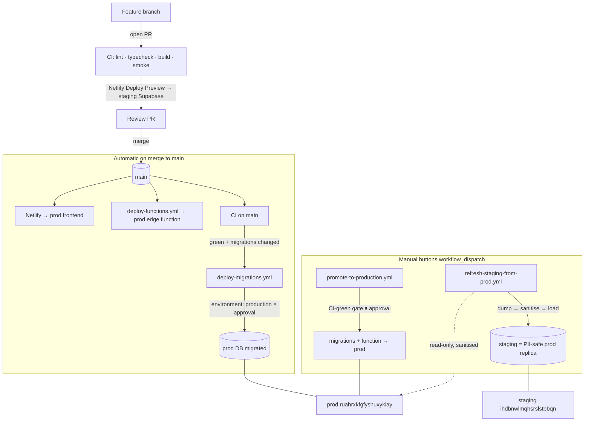

# Staging → Production Workflow Runbook (PawPilotProNew)

Two-stage pipeline: feature branch → PR (CI + Netlify Deploy Preview on staging
Supabase) → merge to `main` → production.

> **See also:** [Full dev→prod pipeline](#full-devprod-pipeline-migrations--sanitised-replica--gated-promotion)
> below documents the automated DB-migration deploy, the PII-safe staging
> replica, and the one-click gated production promotion added on top of the
> original frontend/function flow.

| Layer    | Production                              | Staging                                          |
|----------|-----------------------------------------|--------------------------------------------------|
| Frontend | Netlify site `mdcpppro` → mdc.pawpilotpro.com | Deploy Previews (PRs) + `staging` branch deploy |
| Backend  | Supabase **MDC** `ruahrxkfgfyshuxykiay` | Supabase **MDC-staging** `ihdbnwlmqhsrslstbbqn`  |
| Env vars | prod values (`production` ctx)          | staging values (`deploy-preview` + `branch-deploy`) |

App: `PawPilotPro/project/`. Backend: edge function `make-server-fc003b23`.

> Note: `main` already had a healthy CI (`.github/workflows/ci.yml`: build +
> Playwright smoke + baseline-gated lint/typecheck), `react` in real
> dependencies, and the typecheck/lint scripts. This workflow change does **not**
> touch those — it adds only what was missing for staging isolation.

---

## ✅ Provisioned in this session (live now)

1. **Staging Supabase project** — `MDC-staging` (`ihdbnwlmqhsrslstbbqn`,
   eu-central-2, $10/mo). Active.
2. **Staging schema** — active app schema applied (kv_store + `app` JWT/RLS
   helpers + 8 customer tables + RLS). Security advisor clean. Captured in
   `supabase/migrations/20260625120000_active_schema_baseline.sql`.
3. **Netlify env wiring** on site `mdcpppro`
   (`996cc853-3d8b-433a-a8a7-5b742822c77b`), per context:
   - `production` → prod project / prod URL / prod anon (unchanged)
   - `deploy-preview` + `branch-deploy` → staging project / staging URL / staging anon
   Vars: `VITE_SUPABASE_PROJECT_ID`, `VITE_SUPABASE_URL`, `VITE_SUPABASE_ANON_KEY`.

## ✅ In this PR (repo changes against current `main`)

- **Externalized Supabase config** — `utils/supabase/info.ts` now reads
  `VITE_SUPABASE_PROJECT_ID` / `VITE_SUPABASE_ANON_KEY` from env, **falling back
  to the current prod values** so production is unchanged. This is what makes the
  per-context env wiring actually take effect (previously hardcoded to prod).
- **`.env.example`** documenting the three frontend vars.
- **`.github/workflows/deploy-functions.yml`** — deploys `make-server-fc003b23`
  via the Supabase CLI: push to `staging` → staging, push to `main` → prod.
  Requires a `SUPABASE_ACCESS_TOKEN` repo secret.
- **Migrations** — the two live prod hardening migrations captured exactly, plus
  the active-schema baseline + a README documenting the real migration state.

---

## ⚠️ Latent issue this fixes
Several modules (e.g. `CapacityWidget.tsx`, `QuickNoteModal.tsx`) call
`${import.meta.env.VITE_SUPABASE_URL}/functions/v1/...` with **no fallback**, but
prod's Netlify did not set `VITE_SUPABASE_URL`. Setting it per context (done)
both fixes those calls on future prod deploys and makes them staging-aware.
(Optional cleanup: refactor those modules to derive the URL from `projectId`
for a single source of truth.)

## Your action items (need GitHub admin / a token)
- **A. Edge function → staging.** Add a `SUPABASE_ACCESS_TOKEN` repo secret
  (Settings → Secrets and variables → Actions). Then the deploy-functions
  workflow deploys it (push to `staging` / `main`, or run via "Run workflow").
  First-time staging deploy can also be done locally:
  `cd PawPilotPro/project && SUPABASE_ACCESS_TOKEN=… supabase functions deploy make-server-fc003b23 --project-ref ihdbnwlmqhsrslstbbqn`
- **B. Netlify branch deploys.** Site `mdcpppro` → Build & deploy → Branches →
  add `staging`.
- **C. Branch protection on `main`** → require the CI **build** check
  (Settings → Branches).
- **D. Base directory.** Confirm site `mdcpppro`'s Base directory and delete the
  redundant `netlify.toml` (root vs `PawPilotPro/`).
- Create the `staging` branch from `main` after this merges.

## Branch strategy
`main` → production. `staging` → staging branch deploy. Feature branches → PR →
Deploy Preview (staging Supabase) + CI.

## Migration discipline
Every schema change is a new file in `PawPilotPro/project/supabase/migrations/`,
never ad-hoc dashboard SQL. Full prod parity (incl. invoxia/legacy): see that
folder's README (`supabase db pull`).

---

## Full dev→prod pipeline (migrations + sanitised replica + gated promotion)

This section covers the workflows that make **schema** and **promotion** part of
the pipeline, alongside the existing frontend (Netlify) and edge-function
(`deploy-functions.yml`) automation. Everything here obeys CLAUDE.md: prod is
never mutated without a green CI gate **and** a manual approval, PII is sanitised
before any data leaves prod, and every secret lives in GitHub Actions — never in
the repo.

### End-to-end flow



**Normal path** (no button-pushing): open PR → CI + Netlify preview on staging →
merge to `main` → Netlify ships the frontend, `deploy-functions.yml` ships the
function, and `deploy-migrations.yml` ships migrations to prod **after CI is
green and pausing for approval**.

**`promote-to-production`** is the explicit "push it now / re-run" button — one
approval, does migrations + function to prod in order, prints a summary.

**`refresh-staging-from-prod`** rebuilds staging as a sanitised copy of prod
whenever you want realistic (but PII-free) data.

### Workflows, triggers, and the secret/ref each uses

| Workflow | Trigger | Target | Secrets / refs | Gate |
|---|---|---|---|---|
| `ci.yml` (existing) | PR, push `main` | — | `TEST_EMAIL`, `TEST_PASSWORD`, `vars.SMOKE_BASE_URL` | — |
| `deploy-functions.yml` (existing) | push `staging`/`main` (functions/**), dispatch | staging `ihdbnwlmqhsrslstbbqn` / prod `ruahrxkfgfyshuxykiay` | `SUPABASE_ACCESS_TOKEN` | env `production` on prod path¹ |
| **`deploy-migrations.yml`** (new) | push `staging` (migrations/**) → staging; **CI-green on `main`** (`workflow_run`) → prod; dispatch (env choice) | staging / prod by branch | `SUPABASE_STAGING_DB_URL`, `SUPABASE_PROD_DB_URL` | CI-green (prod) + env `production` approval |
| **`refresh-staging-from-prod.yml`** (new) | **dispatch only** + confirm boolean | reads prod, writes **staging** | `SUPABASE_PROD_DB_URL` (read), `SUPABASE_STAGING_DB_URL` (write) | explicit confirm; no prod writes |
| **`promote-to-production.yml`** (new) | **dispatch only** | prod | `SUPABASE_ACCESS_TOKEN`, `SUPABASE_PROD_DB_URL` | CI-green gate + env `production` approval |

¹ `deploy-functions.yml` predates the `production` environment; add
`environment: production` to its prod path (or just use `promote-to-production`
for prod function deploys) if you want its prod deploys to pause for approval too.

`SUPABASE_*_DB_URL` are **pooler** connection strings (IPv4, password embedded) —
GitHub-hosted runners have no IPv6, so the direct `db.<ref>.supabase.co` host will
not connect. Grab them from Supabase → Project → Settings → Database → *Connection
string* → **Session pooler**.

### PII discipline (non-negotiable)

- **Raw prod PII must never be committed or loaded unsanitised.** The only path
  prod data takes to staging/local is through `scripts/pipeline/sanitise-dump.mjs`,
  which rewrites emails → `user+{id}@example.test`, phones → a fixed fake, names →
  `Test {n}`, and free-text notes → `REDACTED`, including inside `kv_store` JSONB.
- The sanitiser **fails closed**: an INSERT-format dump, an unclassified
  PII-looking column, or any surviving real email address aborts the run.
- `refresh-staging-from-prod.yml` dumps `public` **data only** (never
  `auth.users`/secrets), shreds the raw dump in the same step, and never uploads a
  dump as an artifact. Staging keeps its own throwaway auth users.
- The allow/deny field list lives at the top of `scripts/pipeline/sanitise-dump.mjs`.
  When you add a PII-bearing column, add a rule (or mark it `safe`) there — the CI
  guard will otherwise refuse to replicate.

### Commands

**Refresh staging from prod (sanitised)** — GitHub → Actions → *Refresh staging
from prod (sanitised)* → **Run workflow** → tick *confirm_overwrite_staging* → Run.
Prints per-table row counts on completion. (Run *Deploy DB Migrations* against
staging first if staging's schema is behind, so the target tables exist.)

**Deploy migrations manually** — Actions → *Deploy DB Migrations* → Run workflow →
choose `staging` or `production` (production pauses for approval).

**Prod-shaped local dev DB** (needs the Supabase CLI + Docker):

```bash
# migrations only (empty app data):
scripts/pipeline/dev-local.sh

# pull a sanitised copy of prod (needs your own prod pooler URL):
SUPABASE_PROD_DB_URL="postgresql://postgres.ruahrxkfgfyshuxykiay:…@…pooler.supabase.com:5432/postgres" \
  scripts/pipeline/dev-local.sh --from-prod

# or sanitise a raw dump you already made, then load it:
scripts/pipeline/dev-local.sh --raw my-raw-dump.sql
```

`dev-local.sh` sanitises before loading and writes only to a temp dir — it never
persists a raw dump into the repo.

### One-time human setup

1. **GitHub Actions secrets** (Settings → Secrets and variables → Actions → *New
   repository secret*):
   - `SUPABASE_STAGING_DB_URL` — staging session-pooler connection string (with password).
   - `SUPABASE_PROD_DB_URL` — prod session-pooler connection string (with password).
   - (`SUPABASE_ACCESS_TOKEN` already exists — reused for function deploys.)
2. **`production` Environment** (Settings → Environments → *New environment* →
   `production`): set **Required reviewers = you**. This is what makes the prod
   migration job and `promote-to-production` pause for a click. (Optionally create a
   `staging` environment too; it is referenced but needs no protection.)
3. **Netlify contexts** (site `mdcpppro`): confirm `production` context → prod
   project/URL/anon, and `deploy-preview` + `branch-deploy` → staging
   project/URL/anon (per the "Provisioned" section above). No change needed if
   already set; the pipeline relies on it for preview-on-staging.
4. **Branch protection on `main`** (Settings → Branches): require the CI checks so
   the `workflow_run` prod-migration gate is meaningful.

The first real production promotion is yours to trigger (CI green → *Run workflow*
→ approve). Nothing in these workflows mutates prod without that approval.
